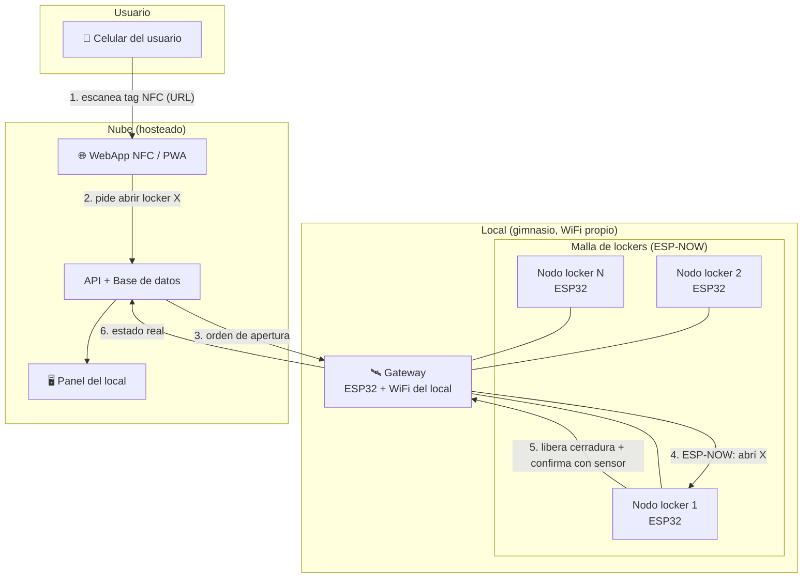
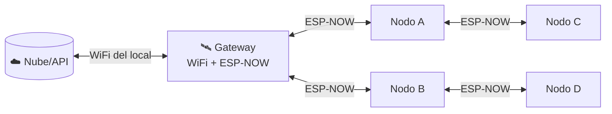
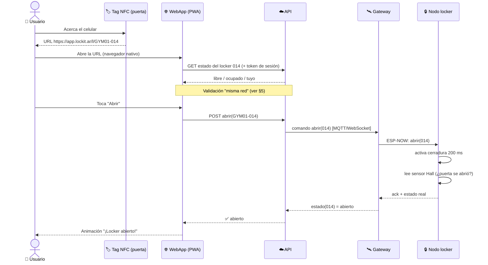
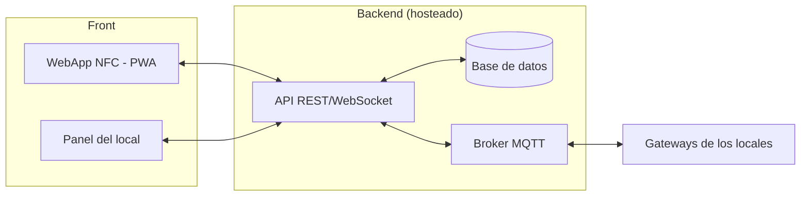

# 02 · Arquitectura Técnica

> Este es el documento central de ingeniería. Describe **cómo funciona todo el sistema**,
> de la punta del celular al fierro de la cerradura. Cada decisión trae su alternativa y el
> porqué, para que sea discutible y quede registrado.

---

## 1. Vista general del sistema

LockIt tiene cuatro capas:

**Resumen del flujo feliz:** el usuario acerca el celu al tag NFC → se abre la webapp →
identifica el locker → pide apertura → la nube manda la orden al gateway → el gateway se la
pasa por malla al nodo del locker → el nodo libera la cerradura y confirma con el sensor
magnético que la puerta se abrió/cerró → el estado sube a la nube y se refleja en el panel.

---

## 2. El nodo del locker (hardware por puerta)

Cada puerta es un **nodo** autónomo con un ESP32. Detalle de componentes y costos en
[`hardware/BOM.md`](../hardware/BOM.md); conexiones en
[`hardware/esquematico.md`](../hardware/esquematico.md).

| Componente | Función | Notas |
|---|---|---|
| **ESP32** (WROOM-32 / C3) | Cerebro del nodo | WiFi + BLE + ESP-NOW. El C3 es más barato; el WROOM tiene más pines. |
| **Cerradura electromecánica 12 V** | Traba física | Solenoide (pestillo) o electroimán. Elegimos **solenoide tipo "cabinet lock"** (consume solo al abrir). |
| **Driver MOSFET / módulo relé** | Maneja los 12 V de la cerradura desde un pin de 3.3 V | MOSFET (ej. IRLZ44N) mejor que relé: silencioso, rápido, sin desgaste. Diodo flyback obligatorio. |
| **Sensor de efecto Hall + imán** | Confirma puerta **cerrada/abierta** | Imán en la puerta, sensor en el marco. Alternativa: reed switch (más barato, menos robusto). |
| **Lector NFC PN532** (opcional en el nodo) | Ver nota abajo sobre dónde va el NFC | En el modelo base el "NFC" es un **tag pasivo** en la puerta, no un lector. |
| **Indicador de estado** | LED (Clear) u **OLED SSD1306 / anillo LED WS2812** (Glow) | Verde=libre, azul=ocupado, parpadeo=abriendo. |
| **Alimentación** | 12 V para cerradura, 3.3 V para ESP32 (buck converter) | Una fuente por columna alimenta a todos los nodos. |

### 2.1 ¿Lector NFC o tag NFC? — Decisión clave

Hay dos arquitecturas posibles para el "NFC en la puerta". Franco describió que el tag
**abre una webapp**, así que la arquitectura base es la **(A)**:

- **(A) Tag NFC pasivo (recomendada, base).** En la puerta va una **etiqueta NFC pasiva**
  (NTAG213/215, centavos) grabada con un registro **NDEF = una URL**, por ejemplo
  `https://app.lockit.ar/l/GYM01-014`. El celular la lee **nativamente** (sin app: Android e
  iOS abren URLs de tags NFC), se abre la PWA y el locker se identifica solo por la URL. **El
  nodo no necesita lector NFC** → mucho más barato y simple. La "inteligencia" de abrir está
  en la webapp + la nube + el ESP32.
- **(B) Lector NFC activo en el nodo.** El nodo lleva un **PN532** y el usuario apoya una
  tarjeta/llavero NFC propio. Sirve para **modo sin celular** (socios con credencial) o
  **modo offline** (abre sin internet validando la tarjeta localmente). Es más caro (~USD 4–8
  por puerta) pero da robustez.

**Plan:** arrancamos con (A) para el prototipo y el piloto. Dejamos (B) como **opción de
nodo "Pro"** para clientes que quieran credencial física o apertura offline garantizada.

---

## 3. Red: cómo se comunican los lockers

### 3.1 Topología elegida: malla ESP-NOW + un Gateway al WiFi

- Los nodos se hablan entre sí con **ESP-NOW** (protocolo de Espressif, sin router, bajo
  consumo, muy confiable en distancias cortas). Forman una **malla** liviana.
- **Un nodo hace de Gateway**: además de ESP-NOW, se conecta al **WiFi del local** y es el
  único que habla con la nube. Recibe órdenes de la API y las reparte por la malla; junta el
  estado de todos y lo sube.

**Por qué así (trade-offs):**

| Opción | Pro | Contra | Veredicto |
|---|---|---|---|
| **A) Todos al WiFi del local (estrella)** | Simple de programar | Depende 100% del WiFi del gym (que suele ser malo/saturado); satura el AP con N clientes | ❌ Frágil |
| **B) Malla ESP-NOW + 1 Gateway** ✅ | Solo 1 dispositivo usa el WiFi; malla robusta; funciona aunque el WiFi ande mal | Hay que manejar el ruteo simple y el rol de gateway | ✅ **Elegida** |
| C) painlessMesh (malla sobre WiFi) | Malla "real" con IP | Más pesado, más consumo, más inestable con muchos nodos | 🔸 Alternativa si ESP-NOW queda corto |
| D) LoRa / RS-485 cableado | Muy robusto/largo alcance | Cableado (RS-485) o licencias/costo (LoRa); over-engineering para un gym | 🔸 Solo para instalaciones grandes/distribuidas |

> **Regla práctica:** ESP-NOW anda excelente hasta decenas de nodos en el radio de un local.
> Si un cliente tiene cientos de puertas en varias salas, se ponen **varios gateways** por
> zona, cada uno con su sub-malla.

### 3.2 Redundancia del gateway
El rol de gateway se puede **elegir por software**: si el gateway se cae, otro nodo con
credenciales de WiFi asume el rol (elección por menor MAC, por ejemplo). Se documenta como
mejora post-piloto.

---

## 4. Flujo de desbloqueo, paso a paso

### Estados de un locker
`LIBRE → RESERVADO(tuyo) → ABIERTO → OCUPADO(cerrado con cosas) → LIBRE (al liberar)`

El **sensor Hall** es lo que distingue "cerrado" de "abierto" de verdad, y evita que el
sistema crea que está ocupado cuando la puerta quedó entornada.

---

## 5. Validación "misma red WiFi" — cómo lo hacemos bien

Franco pidió que la webapp **detecte que está en el mismo WiFi** que los lockers. Un
navegador **no puede leer el SSID del WiFi** por seguridad, así que lo resolvemos de forma
robusta. Opciones reales:

| Método | Cómo | Robustez | Uso |
|---|---|---|---|
| **URL firmada + estar presente físicamente** | El tag solo se puede escanear estando al lado del locker; la URL lleva el id + firma corta | Alta (requiere presencia física) | ✅ Base — el NFC ya prueba presencia |
| **Handshake local (mDNS/IP privada)** | La PWA intenta hablar con el gateway en la LAN (`http://lockit.local`) | Media (CORS/HTTPS mixto complica) | 🔸 Refuerzo opcional |
| **Token de sesión por tiempo** | Al escanear, la API abre una ventana de N minutos para ese locker/usuario | Alta | ✅ Base |
| **Chequeo de IP pública** | La API compara la IP pública del celu con la registrada del gateway del local | Media (WiFi del gym = misma IP saliente) | ✅ Refuerzo simple y efectivo |

**Diseño elegido (defensa en capas):**
1. El **tag NFC prueba presencia física** (estás parado frente al locker).
2. La **API abre una ventana de tiempo** (ej. 90 s) para operar ese locker.
3. La API **compara la IP pública** del celular con la del gateway del local → si coincide,
   está en la misma red del gym (refuerzo, no único). Si el celu está en datos móviles y no
   en el WiFi, se puede pedir un paso extra o igual permitir (configurable por local).

> Así no dependemos de que el navegador "vea el WiFi" (imposible), sino de pruebas reales:
> presencia física (NFC) + ventana temporal + coincidencia de red. Simple y difícil de abusar.

---

## 6. Modo degradado (sin internet)

El WiFi del gym **se va a caer** alguna vez. LockIt no puede dejar a nadie encerrado sin sus
cosas. Estrategias, de menor a mayor costo:

1. **Cache de sesiones en el gateway**: el gateway guarda las reservas activas; si se cae
   internet pero él sigue, resuelve aperturas localmente por un rato.
2. **Apertura por credencial física** (nodo "Pro" con lector NFC, opción B de §2.1):
   funciona 100% offline validando la tarjeta contra una lista local.
3. **Botón/llave maestra de emergencia** por columna para el staff (mecánico, siempre
   funciona aunque se corte la luz).
4. **Falla en seguro configurable**: por política del local, ante corte total la cerradura
   puede quedar **normalmente cerrada** (seguridad) o **liberarse** (que la gente saque sus
   cosas). Recomendado para gimnasios: mantener cerrado + llave maestra del staff.

---

## 7. Software: nube, webapp y panel

- **WebApp NFC (PWA)** — [`../webapp/`](../webapp/): lo que ve el usuario al escanear.
  Rápida, sin instalación, con la marca. Prototipo mock ya incluido en el repo.
- **Panel del local**: ocupación en vivo, asignar/liberar, historial, cobros. (Etapa posterior.)
- **API + DB**: usuarios/sesiones, lockers, locales, eventos. Stack sugerido: Node/TS o
  Python (FastAPI) + Postgres. **A definir en Etapa 2.**
- **MQTT** entre la nube y los gateways: liviano, ideal para IoT, reconexión robusta.

---

## 8. Seguridad y privacidad

- **Tags NFC firmados**: la URL incluye una firma corta para que no se puedan clonar
  arbitrariamente lockers falsos. (NTAG con protección de escritura.)
- **Sesión por tiempo y por usuario**: un locker "tuyo" solo lo abrís vos dentro de la ventana.
- **Comunicación cifrada**: TLS entre PWA/panel y API; ESP-NOW con clave pre-compartida (PMK/LMK).
- **Mínimos datos personales**: se puede usar anónimo (solo id de sesión) o con cuenta según el local.
- **Antiabuso**: rate limiting en apertura; log de todos los eventos para auditoría del local.

---

## 9. Decisiones abiertas (a cerrar en Etapa 2)

- [ ] Cerradura definitiva: solenoide vs electroimán (probar consumo, ruido, robustez).
- [ ] ESP32 WROOM-32 vs C3 (pines vs costo) — decidir tras armar el primer nodo.
- [ ] Stack de backend (Node/TS vs Python/FastAPI) y hosting (Vercel/Fly/Railway/VPS).
- [ ] ¿Nodo base (solo tag) o nodo Pro (lector NFC) para el piloto? — depende del gym piloto.
- [ ] Sensor de puerta: Hall (robusto) vs reed switch (barato) — validar en prototipo.

Ver el plan de validación en [`06-roadmap.md`](06-roadmap.md).
