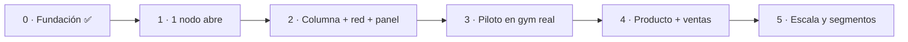

# 06 · Roadmap

> El camino de idea → producto → negocio, por etapas. Cada etapa tiene un objetivo claro y un
> "listo cuando…". Pensado para avanzar con poco capital y validar rápido.

---

## Etapa 0 · Fundación ✅ (actual)

**Objetivo:** definir el producto y dejar todo documentado y diseñado.

- [x] Visión, producto y dos líneas (Clear / Glow).
- [x] Arquitectura técnica completa (ESP32, malla, NFC, sensor, seguridad).
- [x] CAD paramétrico + archivos de fabricación (STEP/STL/DXF).
- [x] BOM, esquemático y esqueleto de firmware.
- [x] Identidad de marca (logo, paleta, tipografía, motion).
- [x] Landing con 3D en vivo + webapp NFC (mock).
- [ ] Estrategia de marketing y borradores de outreach (en curso).

**Listo cuando:** el repo cuenta la historia completa y se puede mostrar a un socio/proveedor.

---

## Etapa 1 · Prototipo funcional (1 nodo)

**Objetivo:** que **una puerta** abra de verdad con NFC.

- [ ] Comprar electrónica de 1 nodo ([BOM](../hardware/BOM.md)).
- [ ] Armar el circuito (cerradura + MOSFET + sensor Hall) en protoboard.
- [ ] Firmware: apertura por pulso + lectura de sensor + máquina de estados.
- [ ] Tag NFC → webapp → "abrir" (aunque sea contra un servidor local).
- [ ] Fabricar **1 gabinete** (melamina) para montar el nodo.

**Listo cuando:** acercás el celu, se abre la cerradura y el sensor confirma el cierre.
**Costo estimado:** bajo (~USD 30–60 electrónica + 1 gabinete).

---

## Etapa 2 · Columna piloto (4 puertas + red)

**Objetivo:** una **columna completa** con malla y panel.

- [ ] 4 nodos + 1 gateway hablando por ESP-NOW.
- [ ] Backend mínimo (API + estado + MQTT) hosteado.
- [ ] Webapp NFC real (asignación, sesión, abrir/liberar).
- [ ] Panel del local (ocupación en vivo, asignar/liberar).
- [ ] Modo degradado sin internet.
- [ ] Cotizar y fabricar la columna (melamina) en Córdoba.

**Listo cuando:** una columna de 4 puertas funciona sola, con panel y sin depender de una PC.

---

## Etapa 3 · Piloto en un gimnasio real

**Objetivo:** validar con usuarios reales y sacar el caso de éxito.

- [ ] Instalar 1–2 columnas en un gimnasio de Córdoba.
- [ ] Medir: tiempo de apertura, tasa de éxito, uso por puerta, incidencias.
- [ ] Iterar UX física (dónde va el tag, luz, etc.) y firmware.
- [ ] Juntar **testimonio + video real** para vender.

**Listo cuando:** el gimnasio lo usa a diario sin que tengas que estar ahí, y tenés métricas + video.

---

## Etapa 4 · Producto y primeras ventas

**Objetivo:** estandarizar y vender a más locales.

- [ ] Congelar diseño "v1" (estructura, electrónica, instalación).
- [ ] Cotizar **serie** (chapa o melamina) para bajar costo por puerta.
- [ ] Precio y contrato (hardware + suscripción, ver [negocio](05-modelo-negocio.md)).
- [ ] Vender a 3–5 gimnasios de Córdoba (outreach + boca a boca).
- [ ] Red mínima de instalación/soporte.

**Listo cuando:** hay clientes pagando y un proceso repetible de venta e instalación.

---

## Etapa 5 · Escala y nuevos segmentos

**Objetivo:** crecer más allá de gimnasios de Córdoba.

- [ ] Coworkings, clubes, escuelas de danza/música.
- [ ] Features premium (cobro por uso, reportes, integraciones).
- [ ] Variante aeropuerto/público (pago por uso, más seguridad).
- [ ] Expandir a otras ciudades / cadenas.

---

## Vista rápida

> **Principio:** cada etapa cuesta poco y prueba algo. No fabricar 50 columnas antes de que
> **una** puerta funcione y **un** gimnasio la use.
