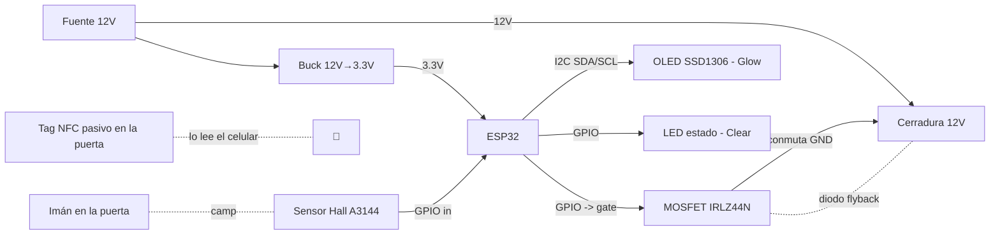

# Hardware · Esquemático de conexiones (nodo)

Diagrama de conexiones de **un nodo** (ESP32 + cerradura + sensor de puerta + indicador).
Pines de referencia para ESP32 WROOM-32 (ajustar en el firmware `config.h`).

## Diagrama de bloques



> En la variante **base**, el NFC es un **tag pasivo** que lee el celular; el ESP32 **no**
> tiene lector. En la variante **Pro**, se agrega un lector PN532 por I2C/SPI al ESP32.

## Tabla de pines (referencia, ESP32 WROOM-32)

| Señal | Pin ESP32 | Notas |
|---|---|---|
| Cerradura (gate MOSFET) | GPIO 25 | Pulso 150–250 ms para abrir. Resistencia 100 Ω en gate, pulldown 10 kΩ. |
| Sensor Hall (puerta) | GPIO 34 (input only) | Pull-up; LOW/HIGH = cerrada/abierta (según imán). |
| LED estado (Clear) | GPIO 26 | LED o data de WS2812 (anillo direccionable). |
| OLED SDA (Glow) | GPIO 21 | I2C. |
| OLED SCL (Glow) | GPIO 22 | I2C. |
| Lector NFC PN532 (Pro) | GPIO 21/22 (I2C) o SPI | Solo variante Pro. |
| Alimentación lógica | 3V3 / GND | Desde buck converter. |

## Circuito de la cerradura (lo más delicado)

```
                +12V
                 │
              [Cerradura solenoide]
                 │
                 ├───────┐
                 │      ─┴─  Diodo flyback (1N4007) — cátodo a +12V
                 │      ───
                 │       │
              Drain      │
   GPIO25 ──[100Ω]── Gate  IRLZ44N (MOSFET N-channel, logic-level)
                    Source
                 │
                [10kΩ] pulldown a GND
                 │
                GND (común con ESP32)
```

**Reglas:**
1. **Masa común** entre 12 V y ESP32 (imprescindible).
2. **Diodo flyback** en antiparalelo a la cerradura (protege del pico inductivo al cortar).
3. MOSFET **logic-level** (IRLZ44N conmuta bien con 3.3 V; un IRF540 común NO).
4. Pulso corto para abrir; nunca dejar la cerradura energizada.

## Alimentación de una columna

```
Fuente 12V 5A ──┬── Nodo 1 (buck → ESP32 + cerradura)
                ├── Nodo 2
                ├── Nodo 3
                └── Nodo 4
```

Una fuente 12 V por columna alimenta todos los nodos (cada uno con su buck para la lógica).
Dimensionar la fuente por el **pico simultáneo** de cerraduras (peor caso: varias abriendo a
la vez → en la práctica se abren de a una, pero dejar margen).

## Seguridad eléctrica

- Fusible en la entrada de 12 V.
- Bornera con protección; cableado prolijo dentro de canaleta.
- En instalación final, certificar según normativa (ver
  [`../docs/04-fabricacion-cordoba.md`](../docs/04-fabricacion-cordoba.md)).
