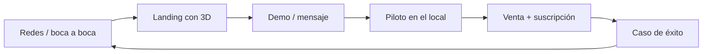

# Marketing · Estrategia

> Cómo damos a conocer LockIt y conseguimos los primeros clientes, con poco presupuesto y
> foco en **gimnasios de Córdoba**. Usa la voz y la paleta de [`../brand/identidad.md`](../brand/identidad.md).

---

## Posicionamiento

> **LockIt es el casillero que se abre con un toque.** Sacá las llaves, los candados y las
> fichas del medio: tus clientes acercan el celu y listo, y vos controlás todo desde un panel.

- **Categoría:** casilleros inteligentes / control de accesos para lockers.
- **Diferenciales:** NFC **sin instalar app** · malla WiFi sin cablear datos · **soporte
  local** (Córdoba) · estética con carácter · dos líneas (Clear/Glow).
- **Contra qué competimos:** candados propios, llaves/fichas, y lockers electrónicos
  importados caros y sin soporte local.

---

## Público y mensaje

| Público | Qué le duele | Mensaje |
|---|---|---|
| **Dueño/gerente de gimnasio** (decisor) | Costo de llaves, robos, imagen, quejas | "Modernizá tus lockers, sacá las llaves del medio y diferenciate." |
| Socio del gym (usuario) | Perder la llave, no saber cuál está libre | "Tu locker, un toque. Sin llaves." |
| Coworking / oficina | Seguridad, prolijidad, estética | "Casilleros premium que se abren con el celu." |

---

## Embudo

- **Tope:** contenido en redes (el 3D y el "wow" del tap venden solos) + outreach directo.
- **Medio:** la [landing](../landing/) explica y genera el contacto ("Pedir demo").
- **Fondo:** demo/piloto → venta. El **caso de éxito** retroalimenta todo.

---

## Canales (priorizados para Córdoba)

1. **Instagram / Reels** — el producto es muy visual (tap → se abre, el 3D). Canal #1.
2. **Boca a boca / relaciones** — el primer gimnasio suele salir de un conocido.
3. **Outreach directo** (mail/WhatsApp) a gimnasios y locales — ver [outreach](outreach-empresas.md).
4. **LinkedIn** — para coworkings, oficinas y clientes B2B más formales.
5. **TikTok** — clips cortos del "wow" y del detrás de escena (fabricación en Córdoba).

---

## Contenido que funciona

- 🎬 **El tap mágico:** primer plano de acercar el celu y la puerta abriéndose.
- 🧩 **El 3D que se arma/desarma** (el de la landing) — muy shareable.
- 🏗️ **Detrás de escena:** fabricación en Córdoba, prototipo, "hecho acá".
- 📊 **Antes/después:** vestuario con candados vs. con LockIt.
- 🗣️ **Testimonio** del gimnasio piloto (cuando esté).

---

## Marca en todo

- Paleta Pulso (verde) + Señal (ámbar) + Grafito. Logo con la onda de pulso.
- Tipografía Archivo + IBM Plex. Motion = "el pulso".
- Todo consistente entre landing, redes, presentaciones y producto físico.
  Ver [`../brand/identidad.md`](../brand/identidad.md).

---

## Métricas

- Alcance/guardados de los reels (señal de "wow").
- Clicks a la landing y contactos "Pedir demo".
- Demos agendadas → pilotos → ventas.
- Costo por lead y por cliente.
